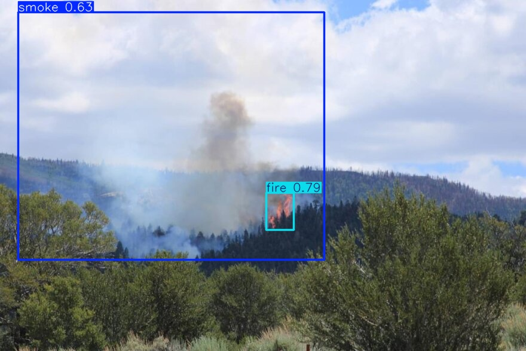
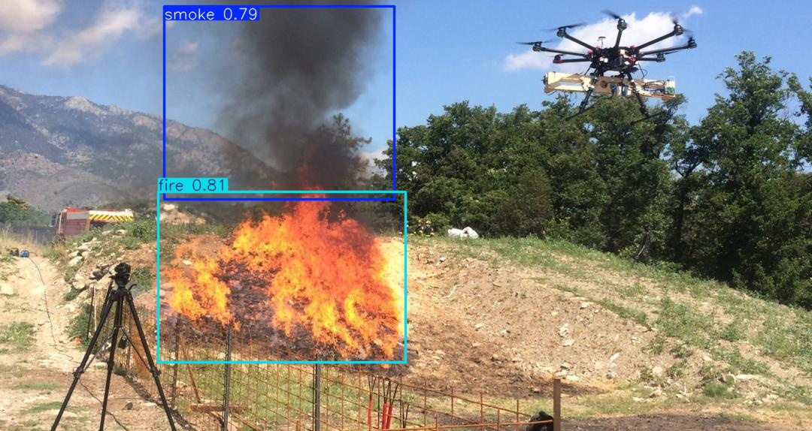
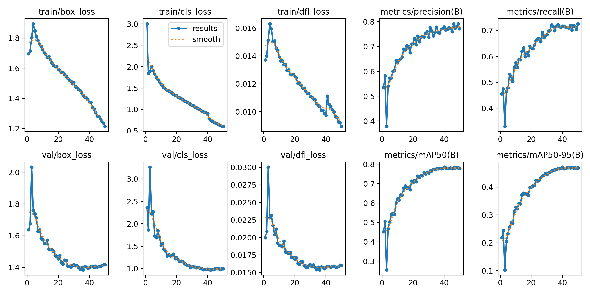

# 🔥 FireVision : Système Intelligent de Détection d'Incendies

## 📖 Présentation du Projet

FireVision est un système de vision par ordinateur basé sur l'architecture **YOLO26s** (Ultralytics), conçu pour détecter les départs de feu et la fumée en temps réel. Entraîné sur le dataset **D-Fire** (14 122 images), ce modèle offre un excellent compromis entre vitesse d'inférence et précision, ce qui le rend idéal pour des systèmes d'alerte précoce.

---

## 🚀 Démonstration en Action

Voici ce dont le modèle est capable sur des données de test inédites. Les résultats ci-dessous ont été générés localement par le modèle final :

### 📸 Détection sur Images

_(Le modèle identifie avec précision les zones critiques et dessine des boîtes de délimitation (bounding boxes) avec un score de confiance)._

<div align="center">
    
    
</div>

### 🎥 Détection sur Vidéo en Temps Réel

_(Test d'inférence continue sur un flux vidéo)_

https://github.com/user-attachments/assets/ed8d1849-2224-4b8b-a35e-26185148fcad

---

## 📊 Performances et Statistiques (Modèle Final — `best.pt`)

Le modèle a été entraîné sur **50 époques** (arrêt automatique à l'epoch **40** via EarlyStopping, patience=10) avec les résultats de validation suivants :

### 🏆 Résultats Globaux

| Métrique      | Valeur |
| ------------- | ------ |
| **mAP50**     | 78,5 % |
| **mAP50-95**  | 47,1 % |
| **Précision** | 78,0 % |
| **Rappel**    | 71,7 % |

### 🔍 Résultats par Classe

| Classe       | Précision | Rappel | mAP50  | mAP50-95 |
| ------------ | --------- | ------ | ------ | -------- |
| 💨 **Fumée** | 82,6 %    | 78,2 % | 83,9 % | 54,1 %   |
| 🔥 **Feu**   | 73,4 %    | 65,3 % | 73,2 % | 40,2 %   |

### 📈 Courbes d'Entraînement

Les courbes suivantes résument l'évolution des pertes et métriques pendant l'entraînement (train / val) :

<div align="center">
    
</div>

### ⚡ Vitesse et Taille

| Paramètre                | Valeur                         |
| ------------------------ | ------------------------------ |
| **Vitesse d'inférence**  | ~3,0 ms / image (GPU Tesla T4) |
| **Prétraitement**        | 0,1 ms / image                 |
| **Post-traitement**      | 0,2 ms / image                 |
| **Poids du modèle**      | ~19 Mo (`best.pt`)             |
| **Durée d'entraînement** | ~4h38 (50 époques, Kaggle GPU) |

---

## 🗃️ Dataset

| Propriété                 | Valeur                  |
| ------------------------- | ----------------------- |
| **Source**                | D-Fire (Kaggle)         |
| **Images d'entraînement** | 14 122                  |
| **Images de validation**  | 3 094                   |
| **Classes**               | `smoke` (0), `fire` (1) |
| **Images de fond**        | 6 458 (sans annotation) |
| **Images corrompues**     | 0                       |

---

## 🏗️ Architecture du Modèle

| Paramètre              | Valeur                       |
| ---------------------- | ---------------------------- |
| **Architecture**       | YOLO26s (Ultralytics 8.4.26) |
| **Couches**            | 122 (fusionnées)             |
| **Paramètres**         | 9 465 954                    |
| **GFLOPs**             | 20,5                         |
| **Taille d'entrée**    | 640 × 640                    |
| **GPU d'entraînement** | Tesla T4 (14 GB)             |
| **Framework**          | PyTorch 2.10 / CUDA 12.8     |

---

## 🛠️ Structure du Projet

```bash
FireVision/
├── data/           # Scripts EDA et graphiques de distribution
├── models/         # Poids du modèle entraîné (best.pt) + résultats (results.png)
├── notebooks/      # Code source de l'entraînement (Kaggle)
├── runs/           # Résultats des prédictions générées par le modèle
│   └── detect/predict/
├── src/            # Scripts d'inférence locaux
│   └── detect.py
├── tests_media/    # Médias originaux pour la validation
└── requirements.txt
```

---

## 💻 Installation et Utilisation

**1. Cloner le dépôt**

```bash
git clone https://github.com/Sofiane-Meziane/FireVision.git
cd FireVision
```

**2. Installer les dépendances**
L'environnement nécessite Python 3.8+ et les bibliothèques suivantes :

```bash
pip install -r requirements.txt
```

**3. Lancer une prédiction**
Le modèle de 19 Mo est directement inclus dans le dépôt. Lancez l'analyse avec :

```bash
python src/detect.py
```

_Note : Les résultats générés (images ou vidéos annotées) seront automatiquement sauvegardés dans le dossier `runs/detect/predict/`._

---

## 👨‍💻 À propos de l'Auteur

**Sofiane Meziane**
_Étudiant en Master 1 Intelligence Artificielle — Université de Béjaïa_

Ce projet a été développé dans le but de consolider mes compétences en vision par ordinateur et en conception de systèmes intelligents de bout en bout.
